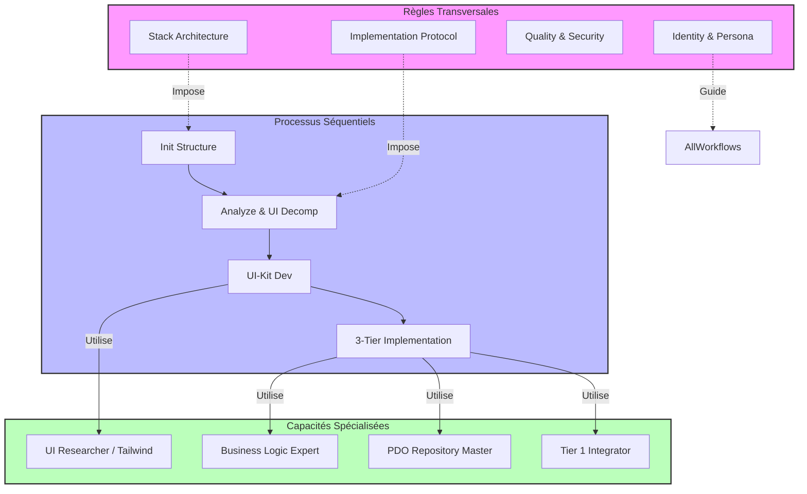

# Vue d'Ensemble de la Cohérence de l'Agent

Ce document synthétise les relations entre les **Règles**, les **Skills** et les **Workflows** définis dans la configuration de l'agent.

## Architecture Conceptuelle

L'agent est structuré autour de trois piliers qui se renforcent mutuellement :

1.  **Workflows** (Le "Quoi" et le "Quand") : Définissent les processus étape par étape. Ils sont les chefs d'orchestre.
2.  **Skills** (Le "Comment") : Capacités spécialisées invoquées par les workflows pour exécuter des tâches techniques précises.
3.  **Règles** (Le "Cadre") : Contraintes immuables qui s'appliquent (transversalement) à toutes les actions.

## Diagramme de Flux Global

## Observations de Cohérence

- **Protocoles d'Implémentation** : La règle `03_implementation_protocol.md` impose un ordre strict (UI-First) qui est parfaitement reflété par la séquence des workflows `analyze` -> `ui-kit` -> `wire-3-tier`.
- **Architecture 3-Tiers** : La règle `01-stack-architecture.md` définit des dossiers (`App`, `Views`, `ui-kit`) qui sont créés par le workflow `init-structure` et peuplés par `ui-kit` et `wire-3-tier`.
- **Isolation** : La séparation nette entre la création visuelle (`ui-kit`) et la logique backend (`wire-3-tier`) respecte le principe de "Séparation des Responsabilités" édicté dans les règles.
