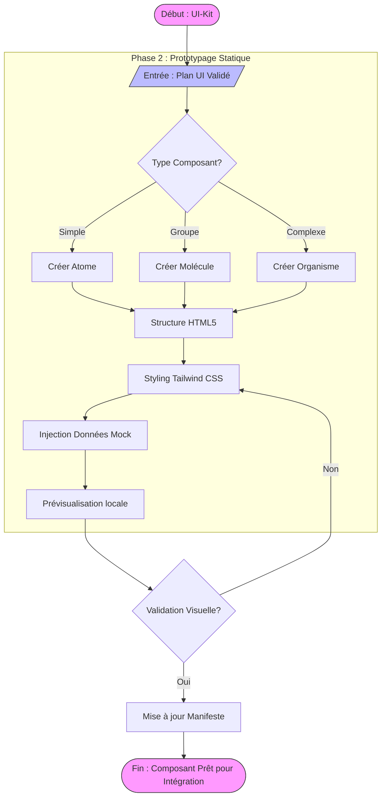

# Visualisation Workflow : UI-Kit (Statique)

Basé sur `.agent/workflows/ui-kit.md`.

## Diagramme de Flux

## Points de Cohérence

- **Règle liée** : `03-implementation-protocol.md` (Phase 2 : Isolation UI-Kit).
- **Skill lié** : `ui-designer-tailwind` (Design, Tailwind, Mocks).
- **Contrainte** : Aucune logique Backend. Fichier 100% autonome.
- **Output** : Fournit le template HTML validé pour le workflow `wire-3-tier`.
