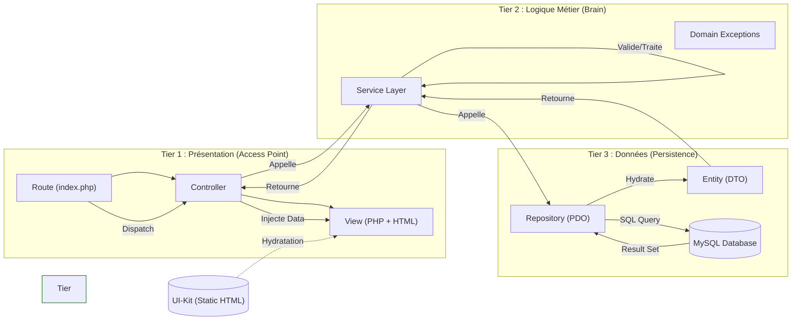

# Visualisation Workflow : Implémentation 3-Tiers

Basé sur `.agent/workflows/wire-3-tier.md`.

## Diagramme d'Architecture & Flux

## Points de Cohérence

- **Règle liée** : `01-stack-architecture.md` (Structure 3-Tiers) et `02-quality-security.md` (PDO, Typage).
- **Skills liés** : 
    - `pdo-repository-master` (Tier 3)
    - `business-logic-expert` (Tier 2)
    - `tier1-integrator` (Tier 1 & Vue)
- **Sécurité** : Le flux garantit que les données brutes (DB) ne touchent jamais directement la Vue sans passer par le Service et le Controller.
